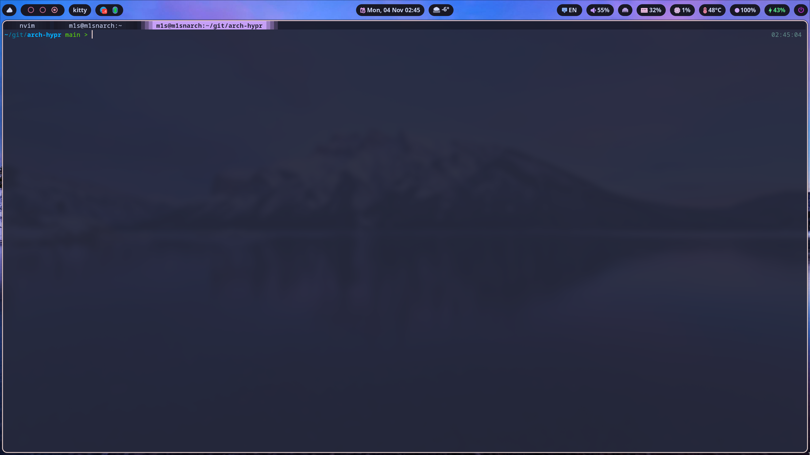

# Установка и настройка Hyprland на ArchLinux

Добро пожаловать! В этом руководстве мы подробно рассмотрим, как скачать, установить и настроить Hyprland на ArchLinux. Мы начнем с установки необходимых пакетов, а затем перейдем к настройке конфигураций.

---

## Скачивание и установка

### Скачивание конфигураций

Для начала вам нужно скачать конфигурации Hyprland. Откройте терминал и выполните следующие команды:

```bash
git clone https://github.com/mi1su/arch-hypr
mv arch-hypr/.config/* ~/.config/  # Переместите содержимое .config в директорию ~/.config
```

После этого вы сможете найти все необходимые файлы в директории `~/.config`.

---

## Информация о системе

| **Info**           | **Soft**        |
| ------------------ | --------------- |
| **Дистрибутив**    | ArchLinux       |
| **WM**             | Hyprland        |
| **Бар**            | Waybar          |
| **Лаунчер**        | Rofi (был Wofi) |
| **Терминал**       | Kitty           |
| **Оболочка**       | Fish            |
| **Уведомления**    | Mako            |
| **Скриншоты**      | Hyprshot        |
| **Блокировка**     | Hyprlock        |
| **Менеджер входа** | Ly              |
|                    | wlogout         |

---

## Примечание

### Конфигурации для Hyprland

Эти конфигурации Hyprland настроены для использования с ArchLinux. Если у вас другая система, вам может потребоваться внести дополнительные изменения.

Это репозиторий с конфигурациями для [Hyprland](https://hyprland.org/), чтобы упростить его использование и настройку.

## Установка пакетов

Для установки необходимых пакетов в Arch Linux используйте пакетные менеджеры `pacman` и `yay`.

### Установленные доп пакеты

Вот список пакетов, которые я установил:

- **acpi** - утилиты для работы с ACPI.
- **acpid** - демон для обработки событий ACPI.
- **acpilight** - управление яркостью экрана.
- **blueman** - менеджер Bluetooth.
- **bluez** и **bluez-utils** - стек Bluetooth.
- **brightnessctl** - утилита для управления яркостью.
- **chromium** - веб-браузер.
- **code** - Visual Studio Code.
- **dnscrypt-proxy** - DNS-прокси для повышения конфиденциальности.
- **firefox** - веб-браузер.
- **fish** - удобная командная оболочка.
- **git** - система контроля версий.
- **htop** - интерактивный мониторинг процессов.
- **neovim** - текстовый редактор.
- **networkmanager** - управление сетевыми подключениями.
- **nvidia-dkms** - драйверы NVIDIA.
- **openvpn** - клиент для VPN.
- **pavucontrol** - графический интерфейс для управления звуком.
- **python** - необходим для работы некоторых скриптов.
- **pipewire** - мультимедийный сервер.
- **telegram-desktop** - мессенджер.
- **xdg-desktop-portal** и **xdg-desktop-portal-hyprland** - интеграция с десктопом.

acpi 1.7-4
acpid 2.0.34-2
acpilight 1.2-3
base 3-2
base-devel 1-2
bash-completion 2.14.0-2
bind 9.20.3-1
blueman 2.4.3-1
bluez 5.79-1
bluez-utils 5.79-1
brightnessctl 0.5.1-3
chromium 130.0.6723.116-1
debtap 3.5.1-1
dnscrypt-proxy 2.1.5-4
docker 1:27.3.1-1
dpkg 1.22.11-1
efibootmgr 18-3
fcron 3.3.1-2
firefox 132.0.1-1
fish 3.7.1-2
git 2.47.0-1
grub 2:2.12-3
htop 3.3.0-3
hypridle 0.1.5-1
hyprland 0.44.1-4
hyprlock 0.5.0-1
hyprpaper 0.7.1-3
hyprshot 1.3.0-1
inetutils 2.5-1
ipset 7.22-1
jq 1.7.1-2
kitty 0.37.0-1
lazygit 0.44.1-1
less 1:661-1
libva-nvidia-driver 0.0.13-1
linux 6.11.6.arch1-1
linux-firmware 20241017.22a6c7dc-1
linux-headers 6.11.6.arch1-1
lsd 1.1.5-1
ly 1.0.2-1
mako 1.9.0-1
mesa-utils 9.0.0-5
microsoft-edge-stable-bin 130.0.2849.80-1
nemo 6.2.8-1
neovim 0.10.2-2
networkmanager 1.50.0-1
newaita-reborn-icons-git r88.5b19f46a-1
nftables 1:1.1.1-1
nmap 7.95-1
nodejs-lts-hydrogen 18.20.4-1
noto-fonts 1:2024.11.01-1
npm 10.9.0-1
ntfs-3g 2022.10.3-1
nvidia-dkms 565.57.01-1
nvidia-prime 1.0-5
nvidia-settings 565.57.01-1
nvm 0.40.1-1
openrazer-daemon 3.9.0-1
openrazer-meta-git 3.8.0.r34.gd52042ab-1
openssh 9.9p1-2
openvpn 2.6.12-1
os-prober 1.81-2
otf-font-awesome 6.6.0-1
pacman-contrib 1.10.6-2
pavucontrol 1:6.1-1
pipewire 1:1.2.6-1
pipewire-alsa 1:1.2.6-1
pipewire-jack 1:1.2.6-1
pipewire-pulse 1:1.2.6-1
polkit-gnome 0.105-11
polychromatic 0.9.3-1
python-hidapi 0.14.0-3
python-pip 24.3.1-1
python-pyquery 2.0.0-4
python-requests 2.32.3-1
python-virtualenv 20.27.1-2
python313 3.13.0-1
qt5-wayland 5.15.15+kde+r60-1
qt5-x11extras 5.15.15-1
rofi 1.7.5-3
rsync 3.3.0-2
rtkit 0.13-3
telegram-desktop 5.7.2-2
tinysparql 3.8.0-1
tmux 3.5_a-1
ttf-dejavu 2.37+18+g9b5d1b2f-7
ttf-font-awesome 6.6.0-1
ttf-hack 3.003-7
ttf-material-design-iconic-font 2.2.0-1
ttf-opensans 1.101-3
unzip 6.0-21
vim 9.1.0785-1
vim-runtime 9.1.0785-1
visual-studio-code-bin 1.95.2-1
waybar 0.11.0-3
wayland 1.23.1-1
wireguard-tools 1.0.20210914-2
wireplumber 0.5.6-1
wlogout 1.2.2-0
wofi 1.4.1-1
xdg-desktop-portal 1.18.4-1
xdg-desktop-portal-hyprland 1.3.8-1
xdg-desktop-portal-wlr 0.7.1-1
xf86-video-amdgpu 23.0.0-2
yay 12.4.2-1
yq 3.4.3-1
zsh 5.9-5

### Установка пакетов

Вы можете установить все необходимые пакеты с помощью следующих команд:

```bash
sudo pacman -S acpi acpid acpilight blueman bluez bluez-utils brightnessctl chromium code dnscrypt-proxy firefox fish git htop neovim networkmanager nvidia-dkms openvpn pavucontrol python pipewire telegram-desktop xdg-desktop-portal xdg-desktop-portal-hyprland
```
sudo pacman -S easyeffects realtime-privileges ladspa
yay -S lsp-plugins

easyeffects
Во вкладке Effects выберите:

Auto Gain (автоматическое усиление тихих источников),

Compressor (сжатие динамического диапазона),

Limiter (защита от перегрузки).

Настройте параметры:


Что дает изменение Target в Auto Gain?
Target: -14 dB — стандартный уровень для стриминга (YouTube, Twitch), чтобы звук был "средней" громкости.

Target: -10 dB — звук станет громче, но есть риск искажений (хрипы, клиппинг), особенно если исходный аудиопоток уже нормализован.

Рекомендация: Начните с -12 dB, проверьте качество. Если звук чистый, можно поднять до -10 dB. Если слышны артефакты — вернитесь к -14 dB.

3. Настройка Compressor и Limiter
Compressor:
Threshold: -30 dB — уровень, выше которого компрессор начинает сжимать звук. Чем ниже (например, -40 dB), тем агрессивнее сжатие (тихие звуки станут громче).

Ratio: 4:1 — степень сжатия. Например, при 4:1 сигнал выше порога уменьшается в 4 раза. Для сильного выравнивания можно поставить 6:1.

Attack: 20 ms — время реакции на превышение порога. Меньшие значения (например, 10 ms) быстрее "зажимают" пики.

Release: 100 ms — время восстановления. Большие значения (например, 200 ms) делают сжатие плавнее.

Limiter:
Threshold: -3 dB — максимальный уровень громкости. Если поставить -1 dB, звук станет чуть громче, но увеличится риск клиппинга.

4. Пример безопасной настройки для максимальной громкости
yaml
Copy
Auto Gain:
  Target: -12 dB

Compressor:
  Threshold: -35 dB
  Ratio: 5:1
  Attack: 10 ms
  Release: 150 ms

Limiter:
  Threshold: -2 dB
---

## Шрифты

Для корректного отображения иконок в вашем окружении вам понадобятся специальные шрифты. Я рекомендую установить следующие шрифты:

1. **Nerd Fonts** - шрифт с множеством иконок.
2. **Font Awesome** - популярный шрифт с иконками.
3. **Material Icons** - шрифт с иконками от Google.
4. **adobe-source-code-pro-fonts** - шрифт для программирования.
5. **cantarell-fonts** - шрифт для интерфейса.
6. **noto-fonts** - шрифт, поддерживающий множество языков.
7. **ttf-dejavu** - шрифт с поддержкой множества символов.

### Установка шрифтов

Вы можете установить их с помощью `pacman` или `yay`. Например:

```bash
yay -S nerd-fonts-complete
yay -S ttf-font-awesome
yay -S ttf-material-design-iconic-font
sudo pacman -S noto-fonts-emoji
```

Однако **Nerd Fonts** лучше скачать с официального сайта: [Nerd Fonts Releases](https://github.com/ryanoasis/nerd-fonts/releases/download/v3.2.1/NerdFontsSymbolsOnly.zip).

**Symbols Only** - это шрифт, содержащий только иконки Nerd Font. Он в основном используется для Waybar.

NerdFonts используется у меня Waybar Wofi Rofi Kitty Mako Hyprlock wlogout zsh

Для waybar kitty rofi mako и скрипт погоды еще нужны иконки которые используюся у меня из грифта Font Awesome

---

Еще для самого hyprland я использую

```bash
exec-once = gsettings set org.gnome.desktop.interface cursor-theme 'DeppinDark-cursors'
exec-once = gsettings set org.gnome.desktop.interface gtk-theme 'Orchis-dark'
exec-once = gsettings set org.gnome.desktop.interface icon-theme 'Rowaita-Adw-Light'
```

т.е потребуется скачать DeppinDark-cursors Orchis-dark Rowaita-Adw-Light но я так и не разобрался в GTK не применяется курсор и тема

## Настройка

После скачивания конфигурации вам нужно внести некоторые изменения, связанные с вашими параметрами:

### Изменения в скриптах

В скрипте `weather.py` необходимо изменить идентификатор города на ваш. Обратите внимание, что без VPN он может не работать. В будущем планируется переработка этого скрипта.

Также в директории `~/.config/hypr/hypr_arch` находится файл `hyprland.conf`, в котором вы можете настроить основные параметры Hyprland, включая путь для сохранения скриншотов.

В файле `hyprlock.conf` измените путь к скриптам, если вы их переместили, и укажите путь к обоям.

В файле `hyprpaper.conf` измените путь, необходимый для установки обоев.

### Настройки для Waybar

В директории `~/.config/waybar` вы найдете скрипты, такие как `weather.sh`, где также нужно изменить название города. Я использую Python, поэтому просто замените название города в соответствующем месте.
Не забудьте, что для управления звуком в Waybar требуется `pavucontrol`.

### Настройки для Wlogout

Поменяйте расположение иконок место $HOME нужно указать свой путь увы css не поддерживает путь через переменные

Для его настройки необходимо чтобы в системыв была поддержка гибернации иначе в логах ошибка
Call to Hibernate failed: Not enough suitable swap space for hibernation available on compatible block devices and file systems

### Настройки для Mako

У меня напсианы дополнительно скрипты для уведомлений о батареи и звука они для mako

Если вы установили `fcron` и хотите настроить его для запуска скриптов при загрузке системы, процесс будет немного отличаться от `cronie`, но в целом остается похожим.

#### Шаг 1: Откройте файл конфигурации fcron

Вместо использования `crontab -e`, для `fcron` использую команду `fcrontab -e`, чтобы редактировать задачи для вашего пользователя:

```bash
fcrontab -e
```

#### Шаг 2: Добавьте задачм для запуска скриптов при загрузке и входе

В открывшемся редакторе добавьте следующие строки:

```bash
@reboot $HOME/.config/mako/scripts/battery-notifier.sh &
@reboot sleep 10 && $HOME/.config/mako/scripts/volume-notifier.sh &
@resume $HOME/.config/mako/scripts/battery-notifier.sh &
@resume sleep 10 && $HOME/.config/mako/scripts/volume-notifier.sh &
```

Эти команды обеспечивают запуск скриптов при загрузке системы и входе пользователя. Задержка в 5 секунд перед запуском второго скрипта позволяет избежать одновременного выполнения скриптов, что приводит к конфликтам.

#### Шаг 3: Проверьте, что задача добавлена

Можно проверить, что задача была добавлена, выполнив:

```bash
fcrontab -l
```

Это покажет все задачи, запланированные для вашего пользователя.

#### Шаг 4: Убедитесь, что скрипты имеют права на выполнение

```bash
chmod +x $HOME/.config/mako/scripts/battery-notifier.sh
chmod +x $HOME/.config/mako/scripts/volume-notifier.sh
```

#### Шаг 5: Проверка работы

После того как вы добавили задачи в `fcron`, перезагрузите систему или выйдите и снова войдите в систему, чтобы проверить, запускаются ли скрипты автоматически. Вы можете протестировать работу скриптов, изменив громкость, и проверить, появляются ли уведомления. Также дождитесь, когда уровень заряда батареи опустится до 30%, или добавьте логирование в скрипты для отслеживания их работы.

#### Дополнительные советы

Для проверки статуса `fcron` используйте следующую команду:

```bash
systemctl status fcron
```

Если `fcron` отключен, вам может потребоваться запустить его впервые, так как он может быть в состоянии `disabled`.

## Горячие клавиши

Вот описание ваших горячих клавиш в виде таблицы на русском языке:

| Клавиши                        | Действие                                                    |
| ------------------------------ | ----------------------------------------------------------- |
| Super + Enter                  | Запустить терминал (kitty)                                  |
| Ctrl + Shift + Escape          | Запустить системный монитор                                 |
| Super + Tab                    | Запустить переключатель окон                                |
| Super + Alt + G                | Отключить эффекты Hypr для игрового режима                  |
| Super + V                      | Запустить буфер обмена                                      |
| Super + D                      | Запустить меню приложений (rofi)                            |
| Super + E                      | Запустить файловый менеджер (nemo)                          |
| Super + L                      | Запустить экран блокировки (hyprlock)                       |
| Super + Print                  | Сделать скриншот всего экрана                               |
| Alt + Print                    | Сделать скриншот активного окна                             |
| Ctrl + Shift + S               | Сделать скриншот выделенной области                         |
| Super + Q                      | Закрыть активное окно                                       |
| Super + Ctrl + Q               | Выйти из сессии                                             |
| Super + [0-9]                  | Перейти на рабочий стол от 0 до 9                           |
| Super + Shift + [0-9]          | Переместить окно на рабочий стол от 0 до 9                  |
| Super + W                      | Переключить окно между фокусом и плавающим                  |
| Super + F                      | Переключить окно между фокусом и полноэкранным              |
| Super + J                      | Переключить режим разделения окон                           |
| Super + стрелка влево          | Переместить фокус на окно слева                             |
| Super + стрелка вправо         | Переместить фокус на окно справа                            |
| Super + стрелка вверх          | Переместить фокус на окно выше                              |
| Super + стрелка вниз           | Переместить фокус на окно ниже                              |
| Alt + Tab                      | Смена фокуса окна (вниз)                                    |
| Super + Alt + стрелка вправо   | Переместить активное окно вправо                            |
| Super + Alt + стрелка влево    | Переместить активное окно влево                             |
| Super + Alt + стрелка вверх    | Переместить активное окно вверх                             |
| Super + Alt + стрелка вниз     | Переместить активное окно вниз                              |
| Super + S                      | Переключить специальное рабочее пространство (magic)        |
| Super + Shift + S              | Переместить окно в специальное рабочее пространство (magic) |
| Super + Shift + стрелка влево  | Переместить окно влево                                      |
| Super + Shift + стрелка вправо | Переместить окно вправо                                     |
| Super + Shift + стрелка вверх  | Переместить окно вверх                                      |
| Super + Shift + стрелка вниз   | Переместить окно вниз                                       |
| Super + колесо мыши вниз       | Перейти на следующий рабочий стол                           |
| Super + колесо мыши вверх      | Перейти на предыдущий рабочий стол                          |
| Super + LeftClick              | Переместить окно с помощью мыши                             |
| Super + RightClick             | Изменить размер окна с помощью мыши                         |
| Super + Ctrl + стрелка влево   | Уменьшить ширину активного окна на 50 пикселей              |
| Super + Ctrl + стрелка вправо  | Увеличить ширину активного окна на 50 пикселей              |
| Super + Ctrl + стрелка вверх   | Уменьшить высоту активного окна на 50 пикселей              |
| Super + Ctrl + стрелка вниз    | Увеличить высоту активного окна на 50 пикселей              |
| Super + Ctrl + H               | Перемещение между сгруппированными окнами назад             |
| Super + Ctrl + L               | Перемещение между сгруппированными окнами вперед            |




## Наслаждайтесь!

---
